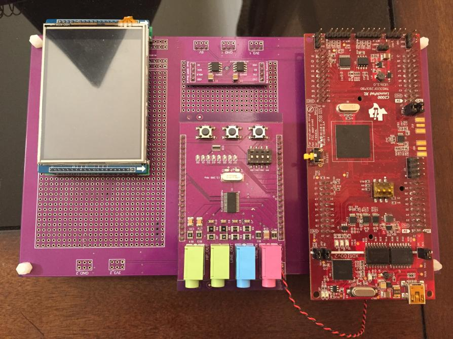
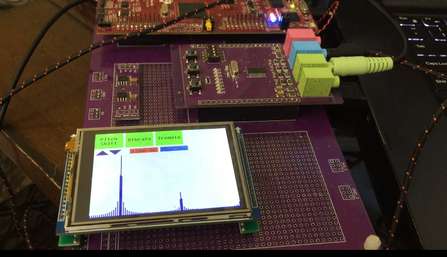

# Real-Time-Spectrum-Analyzer
In the course [EEL 4511 - Real-time DSP Applications](http://www.add.ece.ufl.edu/4511/), during the final two weeks, we were tasked with creating a final project that expanded on knowledge we obtained in the course to come up with a creative real-time DSP (digital signal processing) application.
## Hardware: 
we were given a [C2000](https://www.ti.com/lit/an/sprt720/sprt720.pdf?ts=1610028108582&ref_url=https%253A%252F%252Fwww.google.com%252F) launchpad that had dual core CPUs (fixed-point) which shared data using an IPC module, and each core had [FPU](https://en.wikipedia.org/wiki/Floating-point_unit) which handled computationally intensive insructions. The custom PCB board had a [stereo codec](http://www.add.ece.ufl.edu/4511/references/tlv320aic23b.pdf) that allowed sampling raets up to 96 KHz and a 90 dB SNR. The [C2000](https://www.ti.com/lit/an/sprt720/sprt720.pdf?ts=1610028108582&ref_url=https%253A%252F%252Fwww.google.com%252F) contained a [MCBSP](https://www.ti.com/lit/ug/spruhh0/spruhh0.pdf?ts=1610030520082&ref_url=https%253A%252F%252Fwww.google.com%252F) peripheral that commuincated through I2S with the onboard codec to reicved the digitized audio data from the codec's ADC and send data back to the codec's DAC. In addition to this, my final poroject utilized a resistive touch screen [LCD](https://www.hotmcu.com/28-touch-screen-tft-lcd-with-all-interface-p-63.html) for display and user interface. 

## Software: 
### DSP Algrothims  
  1. Pitch Shifting: 
    The input window went through an FFT process using Texas Instrument intrinsic functions, the data then went through a pitch shifting which was implemented from scratch, lastly the output of the pitch shifting process then went throug an IFFT process to obtain back the signal that contained the same information but played out with a new pitch!. 
  2. Time domain effects: 
    The input window of data could have also went through a dealy based DSP algrothim that modulated the amplitued and added a delay by storing the data into a temporary buffer and playing it later. These dealy based effects where used to create [Termolo](https://en.wikipedia.org/wiki/Tremolo) and [Virbrato](https://en.wikipedia.org/wiki/Vibrato) 
  3. DMA PING/PONG Buffers:
  The input data was recived/processed/sent using DMA ping-pong buffers. The input data consisted of 1024 samples obtained from the codec using I2S and the output buffer was   also a 1024 processd data that was send out to the codec using I2S the actual send and recived process was done via DMA to free up the CPU time. I used Full and Empty flags for debugging to control the the DMA process and insure that the algorithim is quick enough so that real time input data samples are never lost. 
  4. Spectrum Analyzer: 
  After the [FFT](https://en.wikipedia.org/wiki/Fast_Fourier_transform) process, the maginuted response of the audio data which contained (potentially) multipule frequncies  using the frequency response was obtained, and the 
 were dsiplayed on the LCD.  
### User interface: 
  To handle the user interface and the display, I used a a resistive touch screen [LCD](https://www.hotmcu.com/28-touch-screen-tft-lcd-with-all-interface-p-63.html), the second CPU was used to handle the LCD driver and the GPIO interrupts that were triggried when the user touhed the screen while the first CPU handled the audio processing. The magnitude response data that was obtained by the frist CPU, was shared via an IPC mechanisim with the second CPU to be displayed on the LCD screen. 

